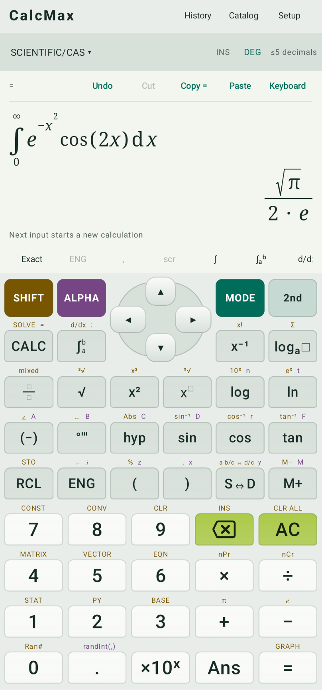

# CalcMax
<p align="center">
  
</p>

A native Android scientific, graphing, programming and Computer Algebra System (CAS) calculator. A bundled SymPy engine provides exact offline mathematics.



## 📥 Download
You can download the latest release from the [Releases Page](https://github.com/kirinonakar/calcmax/releases).

## 🌐 Web version
Try CalcMax in your browser: [kirinonakar.github.io/calcmax](https://kirinonakar.github.io/calcmax/).

## Everyday use

* The first keypad page groups scientific and numeric operations. The second page groups symbolic tools.
* Long-press a key to apply its SHIFT function directly; long-press the mode indicator below the title bar to jump straight to the Scientific/CAS workspace.
* `Keyboard` enables Android text entry; software keyboard input overlays the lower keys without resizing the instrument, and hardware keyboards also work in the natural display. `Paste` inserts clipboard text. `Copy` copies a selected expression when one is selected; otherwise it alternates between the answer and expression. `Cut` copies and removes a selected expression.
* The button row below the input display scrolls horizontally. `Exact`/`≈ Decimal` switches how results are shown, `ENG`/`SCI` cycles through standard, engineering and scientific notation, `,` toggles thousands separators, and `scr` expands or restores the calculation screen. Use the settings icon at the end of the row to customize up to six shortcut buttons between `scr` and `Share`.
* S⇔D switches exact and decimal results; SHIFT S⇔D switches improper/mixed fractions.
* The top `History` button shows up to 500 past calculations, newest first. Search or reuse an entry, mark it with the star button, or switch to `Favorites` to see starred calculations.
* The top `Catalog` button opens the searchable function catalog. Its `Recent` list shows recently used functions, and functions can be starred for its `Favorites` list. Swipe horizontally to browse categories.
* RCL lists stored variables; tap one to insert its name into the current expression. SHIFT RCL (STO) opens the variable editor for storing, recalling, and deleting values. CALC on a recalled expression prompts for its input variables and shows the expression alongside their values. SHIFT AC is CLR ALL and clears the visible tape and variables while preserving History, settings, assumptions and custom functions.

### LaTeX paste

Paste supported LaTeX into the calculator with `Paste` or the Android keyboard. CalcMax converts it to an editable expression that can be calculated. Display math delimiters (`\[...\]` and `$$...$$`), fractions, definite integrals, basic functions and symbols are supported. For example:

```latex
\[\frac{x^2+1}{x-1}\]
\[\int_{1}^{e}\frac{1}{x}\,dx=1\]
$$\int_{0}^{\infty} e^{-x^2} \times \cos(2x) \, dx$$
```

### Numbers and precision

Decimal literals are exact rationals. Internal precision (3–200 significant digits, default 30) drives numeric algorithms, while display digits (default 10) limit the number of digits after the decimal point in results, including the mantissa of scientific and engineering notation. Trailing zeros are omitted; exact integers, fractions and symbolic forms are never rounded, and Ans/STO keep the full-precision value. Numeric trig honors DEG/RAD/GRAD; explicit π or ° specifies a radian/degree expression. Symbolic calculus is in radians. Complex values use `i`; `polar(r,theta)`, `rectpolar(z)`, `re`, `im`, `arg` and `conj` are available.

Integer powers are calculated exactly when the estimated result is at most 100,000 digits. Larger powers remain in exact power form instead of allocating a huge integer. Numeric exponents can exceed 100,000 when the result remains within that size; symbolic bases such as `x^1000000000` retain large exponents. Scientific notation accepts exponents through ±100,000. Exact integers above 10,000 digits are abbreviated on screen, while Ans and stored values keep every digit. Evaluations also have a time budget (normally 8 seconds, with a 20-second Android service deadline).

### Workspaces

MODE opens scientific/CAS, graphing, Python, equations, matrix, vector, statistics, programmer, units, constants, tip, currency and custom functions workspaces.

* **Graphing** — supports Cartesian, implicit, parametric, polar, sequence, 3D surface and first-order differential-equation graphs. Graph tables show sampled values and tapping a row traces the corresponding point. Expressions may use free parameters such as a, b and c; the graph panel adds an adjustable range slider and an editable value for each parameter. Enter a value and press Done/Enter or leave the field to apply it; values outside the slider range expand that range automatically. Animate sweeps their values to explore a family of curves. Directional pinches lock to x for horizontal finger placement, y for vertical placement, and equal x/y scaling for diagonal placement. Tap a number once to select it and again to place its blinking internal cursor.
* **Python** — edits and runs scripts using the bundled interpreter. New/Open/Save/Save as use Android's document picker for `.py` files. Import and Function menus insert common statements and templates. Choosing a function from the shared Catalog inserts `calc.function(...)` at the Python cursor, or `print(calc.function(...))` in an empty file, and places the catalog and symbol imports once at the top. The bundled adapter supports calculator catalog functions, symbols and saved custom functions; use Python's `**` for exponentiation. Completion suggestions include Python names, names in the script and common module members. Choosing a module completion also inserts its import if needed. Execution can be stopped and has a 20-second service deadline. Imports are limited to Python's bundled and installed packages.
* **Equations** — provides coefficient forms for linear/quadratic/cubic equations, multi-line systems, general exact/numeric solving, and forms for `dsolve` and `pdsolve`.
* **Data & Statistics** — saves named one-column lists and x,y or x,y,z datasets locally, imports and exports CSV, and recalls datasets into the calculator. Enter data once to summarize each column and run t and z tests, χ² independence, Fisher exact, one-way ANOVA, Tukey–Kramer pairwise comparisons, and confidence intervals. In x,y data, tests can treat columns as samples or x as a group label and y as a value or category. The x,y mode also supports correlation, scatterplots, and linear, quadratic, logarithmic, exponential, power, and custom nonlinear regression. Histograms and box plots show all available columns. Custom models accept an expression, independent variable, and optional parameter initial values and bounds; fitted parameter values are shown separately.
* **Programmer** — inputs use the selected base, mask to 8/16/32/64 bits, and expose all four bases. Shift counts are entered in the selected base; right shifts are arithmetic in signed mode and logical in unsigned mode.
* **Currency** — supports a manual rate or the latest [ExchangeRate-API daily reference rates](https://www.exchangerate-api.com/docs/free). A successful download is cached privately with both its provider reference time and local fetch time. Online-mode entry checks the cache; a download is performed only when the cache is at least 24 hours old.
* **Functions** — provides creation, editing, insertion and deletion of reusable formulas, plus JSON export and import of the custom library through Android's document picker.

## Examples

```text
2+3*4
1/3+1/6
sqrt(8)
sin(30°)
sin(pi/6)
factor(x^4-1)
diff(sin(x^2),x)
integrate(x^2*exp(x),x)
integrate(x^2,x,0,1)
integrate(exp(-x^2)*cos(2x),(x,0,oo))
limit(sin(x)/x,x,0)
limit(1/x,x,0,left)
series(exp(x),x,0,6)
solve(x^2-5x+6=0,x)
solve([x+y=3,x-y=1],[x,y])
solve(x^2<4,x)
nsolve(cos(x)-x,x,0,1)
nintegrate(sin(x),x,0,pi)
det([[1,2],[3,4]])
eigenvalues([[1,0],[0,2]])
dot([1,2,3],[4,5,6])
prime(1000)
isprime(123457)
stats([1,2,3,4])
regression([[1,2],[2,4],[3,6]],linear)
convert(32,degF,degC)
qty(2,m)+qty(30,cm)
convert(qty(1,kg)*qty(2,mps2),N)
apart(1/(x*(x+1)),x)
gradient(x^2+y^2,[x,y])
dsolve(diff(y(t),t)=y(t),y(t),t)
laplace(sin(t),t,s)
ztrans(a^n,n,z)
invztrans(z/(z-2),z,n)
mellin(exp(-x),x,s)
invmellin(gamma(s),s,x)
pdsolve(diff(u(x,y),x)+diff(u(x,y),y)=0,u(x,y))
charpoly([[1,2],[3,4]],x)
convert(qty(1,V)/qty(1,ohm),A)
normcdf(-1.96,1.96)
invnorm(0.975)
ttest(0,[1,2,3,4])
tinterval(0.95,[1,2,3,4])
npv(0.1,-1000,[300,400,500])
tvmpmt(360,0.05/12,250000)
cagr(1000,2000,5)
```

## Build

### Static WebAssembly version

The `web/` folder contains a static browser port using the same Python/SymPy engine through WebAssembly, with Korean/English UI and light/dark/system themes. It needs no calculation backend.

For GitHub hosting, select **Settings → Pages → Source → GitHub Actions** once. The included **Deploy CalcMax Web** workflow builds and publishes the static `index.html` site on pushes to `main`. Once deployment succeeds, open [CalcMax Web](https://kirinonakar.github.io/calcmax/).

```powershell
python web/build.py
python web/serve.py
```

Open `http://localhost:8080`. Upload the complete built `web/` folder (including the generated runtime) to a static host. See [web/README.md](web/README.md) for deployment, features, offline caching and validation.

### Android

Requirements: JDK 21 (Android Studio's bundled runtime works), Android SDK 37, Python 3.14 on PATH, and an initial internet connection to download build dependencies. The installed application computes offline. Supported devices: Android 8/API 26 or later, arm64-v8a and x86_64.

```powershell
$env:JAVA_HOME='C:\Program Files\Android\Android Studio\jbr'
.\gradlew.bat :app:assembleDebug
```

APK: `app/build/outputs/apk/debug/app-debug.apk`. `:app:assembleRelease` builds the unsigned release variant; use your own signing credentials for distribution. No release signing secret is checked in.

### Backup policy

Android Auto Backup includes only `calculator.xml`: settings, history (when enabled), variables, functions, graph and statistics work, and the current Python draft. This file can contain private calculations or code. Cloud backup requires client-side encryption on Android 9–11 and encryption capability on Android 12 and later. Android 8–8.1 does not back up this file. Device transfer includes the same file on Android 12 and later. The downloaded exchange-rate cache and `calculator-local.xml` are excluded. The latter stores the Python document URI, whose file access grant belongs to the current device; after a restore, the draft remains available and saving it may require **Save as**.

## Architecture

```text
math/           Pure Kotlin lexer, Pratt parser, immutable source-spanned AST, editor
app/.../ui/     Native Compose mathematical layouts, keypad and mode workspaces
app/.../calculator/
                ViewModel orchestration, graph/statistics/Python workspace state,
                local persistence, typed AST JSON process protocol
app/src/main/python/calc_engine.py
                Chaquopy entry point, request budgets and response assembly
app/src/main/python/calc_evaluator.py
                Validated AST -> SymPy expression evaluation
app/src/main/python/calc_display.py
                Result trees, formatting and reusable result ASTs
app/src/main/python/calc_graph.py
                Graph sampling, shading, parameters and analysis
app/src/main/python/calc_statistics.py
                Distributions, statistical tests and regression
app/src/main/python/calc_finance.py
                Time-value-of-money and cash-flow functions
app/src/main/python/calc_programmer.py
                Fixed-width integer operations
app/src/main/python/calc_shared.py
                Limits, units, constants and shared math helpers
app/src/main/python/quantities.py
                Dimension algebra independent of Android
tests/          Desktop integration and randomized exact arithmetic tests
```

Scientific, CAS, equation, graphing, matrix/vector and statistics operations consume the same AST. Graphing compiles already validated symbolic expressions to local numeric functions; it never parses a separate expression language. Tip and currency forms use exact decimal value objects from the independent math module. SymPy's `parse_expr` and unrestricted string `eval` are not used for user input. Result ASTs preserve Ans/STO values without reparsing printed mathematics. The engine adapter isolates the UI from SymPy.

Computation runs in a bound service in a separate `:math` process. The calculator expression engine has recursion, AST size, numeric size, step and time limits. A 20-second IPC deadline can terminate and restart the worker process; cancellation therefore also works for operations that do not cooperate with coroutine cancellation. The expression engine's default budget is eight seconds; heavy symbolic calls such as integration and transforms keep a larger step allowance and may use up to sixteen seconds inside the IPC window. Python mode runs the user's script directly in the service process and is subject to the IPC deadline. Errors and unevaluated symbolic results are displayed rather than replaced by fabricated answers.

## Validation

```powershell
.\gradlew.bat :math:test :math:exportCases :app:lintDebug
python -m venv .venv
.\.venv\Scripts\python.exe -m pip install sympy==1.14.0
.\.venv\Scripts\python.exe -m unittest discover -s tests -v
.\gradlew.bat :app:connectedDebugAndroidTest
```

The desktop tests consume AST fixtures produced by the actual Kotlin parser. They cover the specification's exact examples, precedence, complex arithmetic, calculus, solving, domains, matrices, statistics, graph discontinuities, units, precision, safeguards, result serialization and 100 seeded rational arithmetic cases. Device tests cover the native keypad, actual service IPC, cancellation/recovery, CAS, graphing, saved variables, activity recreation, both themes, system theme changes and landscape. Regression tests also assert live results without `=`, unchanged keypad bounds, boxed-answer continuation, vertical history gestures, fraction exit hit targets, symbolic/decimal typesetting and calculus at bounds/points. Tests produce screenshots in the app's private `files/qa` directory.

## Explicit bounds

* Symbolic integration/solving is subject to SymPy's algorithmic coverage and the computation budget. Unsolved integrals and conditional solution sets are retained with an explanatory message. There is no claim of solving every possible symbolic problem.
* Matrix entry grid: up to 9×9 and vector entry: up to 9 components; expression matrices: up to 32×32. Large exact factorizations/eigensystems may time out.
* Graphs use bounded adaptive samples; very narrow features can still be missed. Cartesian analysis controls apply only to Cartesian functions. The RK4 differential-equation plots are numerical approximations, and 3D surfaces use a finite grid with wireframe, shaded surface, or surface-plus-mesh rendering, customizable colors, and adjustable density from 12×12 to 96×96 (automatic density adapts to the range and zoom).
* General output such as condition sets and series remainder terms can use textual mathematical notation where a dedicated native layout is not available. Such results may be copyable but not reusable through Ans; the app disables result insertion for them.

## 📄 License

This project is licensed under the MIT License - see the [LICENSE](LICENSE) file for details.

Copyright (c) 2026 **kirinonakar**.

## Third-party notices

SymPy 1.14.0 and mpmath 1.3.0 use BSD licenses. Chaquopy 17 uses the MIT license. Full licenses are included in `app/src/main/assets/licenses/`; Python and native runtime notices are also packaged by Chaquopy. AndroidX uses Apache 2.0.
