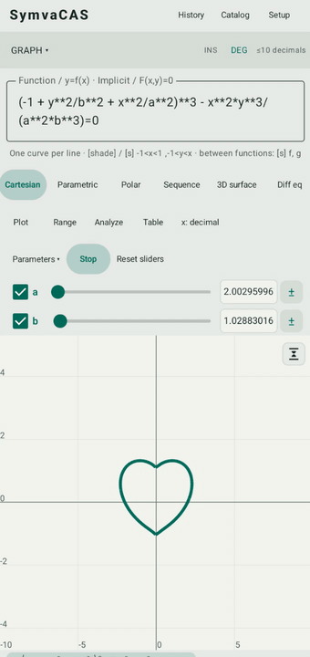

# SymvaCAS
<p align="center">
  
</p>

**Scientific calculator · CAS · Graphing · Statistics · Python**

A native Android calculator powered by **SymPy**, with exact symbolic math, numerical computation, graphing, statistics, and programmable workflows in one app.

[](https://kirinonakar.github.io/symvacas/)

[**Download Android release**](https://github.com/kirinonakar/symvacas/releases) · [**Open web version**](https://kirinonakar.github.io/symvacas/)
</div>

<p align="center">
  
  
</p>

## Highlights

- **Exact and numerical mathematics** — fractions, symbolic expressions, arbitrary precision, calculus, limits, series, equation solving, transforms, and more.
- **2D and 3D graphing** — Cartesian functions, implicit curves, parametric and polar graphs, sequences, 3D surfaces, and first-order differential equations.
- **Interactive parameters** — use variables such as `a`, `b`, and `c` in graph expressions, adjust them with sliders, or animate parameter sweeps.
- **Statistics and probability** — descriptive statistics, hypothesis tests, confidence intervals, correlation, regression, common distributions, and practical probability tools.
- **Equations, matrices, vectors, units, finance, and programmer tools** — organized into dedicated workspaces.
- **Python workspace** — edit and run Python scripts with access to calculator functions and symbols.
- **LaTeX paste** — paste supported LaTeX and convert it into an editable calculator expression.
- **Offline calculation on Android** — the bundled SymPy engine performs calculations locally. Online access is only needed for optional features such as refreshed currency rates.

## Workspaces

| Workspace | What it provides |
| --- | --- |
| **Scientific / CAS** | Exact arithmetic, symbolic algebra, calculus, transforms, solving, complex numbers, precision controls |
| **Graphing** | Function and implicit plots, parametric, polar, sequence, 3D surface, ODE plots, trace and curve analysis |
| **Equations** | Polynomial equations, systems, general solving, `dsolve`, and `pdsolve` |
| **Matrix / Vector** | Matrix algebra, determinants, eigenvalues, vector operations, and related tools |
| **Statistics** | CSV data, summaries, tests, confidence intervals, correlation, regression, histograms, and box plots |
| **Probability** | Common distributions plus presets for coins, dice, cards, conditional counts, and sampling |
| **Python** | Script editor and runner with calculator-function integration |
| **Programmer** | Binary/octal/decimal/hex values, fixed-width integer operations, signed/unsigned shifts |
| **Utilities** | Units, physical constants, finance, currency, tips, and reusable custom functions |

## Example expressions

```text
1/3 + 1/6
sqrt(8)
sin(30°)
factor(x^4 - 1)
diff(sin(x^2), x)
integrate(exp(-x^2)*cos(2*x), (x, 0, oo))
solve(x^2 - 5*x + 6 = 0, x)
solve([x+y=3, x-y=1], [x,y])
limit(sin(x)/x, x, 0)
det([[1,2],[3,4]])
eigenvalues([[1,0],[0,2]])
gradient(x^2+y^2, [x,y])
dsolve(diff(y(t),t)=y(t), y(t), t)
normcdf(-1.96, 1.96)
convert(32, degF, degC)
npv(0.1, -1000, [300,400,500])
cagr(1000,2000,5)
```

### Implicit graph with parameters

```text
(-1 + y^2/b^2 + x^2/a^2)^3 - x^2*y^3/(a^2*b^3) = 0
```

Use `a` and `b` as graph parameters to change or animate the curve interactively.

## LaTeX paste

Paste supported LaTeX directly into the Android or web calculator. Common delimiters such as `$...$`, `$$...$$`, `\(...\)`, and `\[...\]` are accepted.

```latex
\frac{x^2+1}{x-1}
\int_{0}^{\infty} e^{-x^2}\cos(2x)\,dx
\lim_{x \to 0} \frac{\sin x}{x}
\begin{bmatrix}1 & 2 \\ 3 & 4\end{bmatrix}
```

## Precision and evaluation

SymvaCAS keeps exact values whenever possible and uses configurable arbitrary precision for numerical algorithms.

- Internal precision: **3–200 significant digits** (default: 30)
- Display precision is configurable independently
- `Ans` and stored variables keep their full internal value
- Trigonometric evaluation supports **DEG / RAD / GRAD**
- Complex numbers use `i`
- Very large exact results and expensive symbolic operations are bounded to avoid runaway memory or computation

## Build

### Android

Requirements:

- JDK 21
- Android SDK 37
- Python 3.14 on `PATH`
- Android 8 / API 26 or later

```powershell
$env:JAVA_HOME='C:\Program Files\Android\Android Studio\jbr'
.\gradlew.bat :app:assembleDebug
```

Debug APK:

```text
app/build/outputs/apk/debug/app-debug.apk
```

`:app:assembleRelease` builds the unsigned release variant. Use your own signing credentials for distribution.

### WebAssembly version

The `web/` directory contains a static browser version using the same Python/SymPy calculation engine through WebAssembly.

```powershell
python web/build.py
python web/serve.py
```

Then open `http://localhost:8080`.

For GitHub Pages, set **Settings → Pages → Source → GitHub Actions**. The included workflow builds and deploys the web version on pushes to `main`.

See [`web/README.md`](web/README.md) for web-specific build and deployment details.

## Technical overview

SymvaCAS uses a shared expression model across scientific calculation, CAS, equations, graphing, matrices, vectors, and statistics.

- A **Kotlin lexer, Pratt parser, and source-spanned AST** handle calculator input.
- Validated expressions are evaluated by the bundled **SymPy** engine through Chaquopy.
- Calculator input does **not** use SymPy `parse_expr` or unrestricted string `eval`.
- Heavy calculation runs in a separate Android `:math` process with size, recursion, step, and time limits.
- Graphing evaluates already validated expressions rather than introducing a separate expression language.
- Result values are preserved structurally so `Ans` and stored variables do not need to reparse formatted output.

Python mode is intentionally separate: user scripts run as Python code inside the calculator service and are subject to the service execution deadline.

## Limitations

- Symbolic integration and solving depend on SymPy's supported algorithms and the app's computation budget; some expressions may remain unevaluated.
- Numerical graphs use finite adaptive sampling, so extremely narrow or pathological features can be missed.
- Large exact matrix operations, factorizations, eigensystems, or symbolic expressions may reach configured computation limits.

## License

This project is licensed under the MIT License - see the [LICENSE](LICENSE) file for details.

Copyright © 2026 **kirinonakar**.

## Third-party notices

SymPy 1.14.0 and mpmath 1.3.0 use BSD licenses. Chaquopy 17 uses the MIT license. Full licenses are included in `app/src/main/assets/licenses/`; Python and native runtime notices are also packaged by Chaquopy. AndroidX uses Apache 2.0.